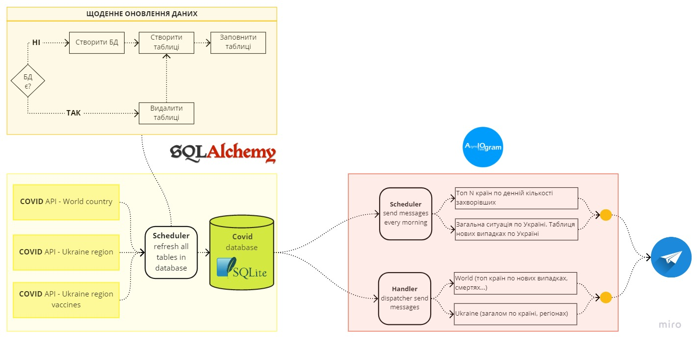
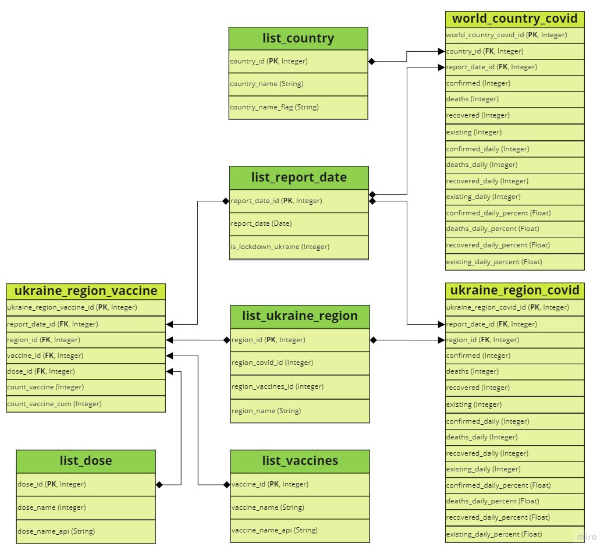

- [TODO](#todo)
- [Архітектура](#архітектура)
- [Структура БД](#структура-бд)
  - [Таблиці-словники](#таблиці-словники)
  - [Таблиці із стат.показниками](#таблиці-із-статпоказниками)
- [Структура файлів і класів](#структура-файлів-і-класів)

## TODO
- доробити вітку по Регіонах
- додати в БД статитсику по госпіталізації
- описати кнопки
- зробити таблицю із юзерами і розсилати повідомлення із таблиці
- зробити готові агрегативні таблиці в БД для швидкого відправлення повідомлень
- адмінка
- звіти автору по статистиці
- ...
- 
## Архітектура

Статистичні показники по захворюванню на covid отримуються по API, оброблюються і зберігаються (повністю перезаписуються) в базу даних щодня. Після запису нових даних в БД, відправляються повідомлення через бот із інформацією: загалом по Україні і областях, топ країн по нових випадках у світі.

## Структура БД

### Таблиці-словники

**list_country** - список країн:
- *country_id* - ID країни;
- *country_name* - назва країни англ. мовою, за допомою цієї назви формується запит по API (не змінювати);
- *country_name_flag* - запис країни для формування emoji-прапору країни;

**list_report_date** - список дат (щоденні дати):
- *report_date_id* - ID дати;
- *report_date* - дата (щоденна);
- *is_lockdown_ukraine* - пусте поле; 

**list_ukraine_region** - список областей України:
- *region_id* - ID області;
- *region_covid_id* - значення для області, за допомогою якого формується запит по API кількості хворих (не змінювати);
- *region_vaccines_id* - значення для області, за допомогою якого формується запит по API по вакцинації (не змінювати);
- *region_name* - назва області;

**list_vaccines** - список вакцин:
- *vaccine_id* - ID вакцини;
- *vaccine_name* - назва вакцини;
- *vaccine_name_api* - значення, яке використовується для формування запиту по API; 

**list_dose** - список доз вакцин (перша, друга, третя):
- *dose_id* - ID дози;
- *dose_name* - назва дози;
- *dose_name_api* - значення, яке використовується для формування запиту по API;

### Таблиці із стат.показниками

**world_country_covid** - статистичні показники по країнах світу:
- *world_country_covid_id* - ID запису в таблиці;
- *country_id* - ID країни;
- *report_date_id* - ID дати (щоденні дати);
- *confirmed* - кумулятивна кількість нових випадків на дату;
- *deaths* - кумулятивна кількість смертей на дату;
- *recovered* - кумулятивна кількість перехворівших на дату;
- *existing* - кумулятивна кількість хворих на дату - *не розумію цього поля!!!*;
- *confirmed_daily* - кількість за добу нових випадків на дату; 
- *deaths_daily* - кількість за добу смертей на дату; 
- *recovered_daily* - кількість за добу перехворівших на дату; 
- *existing_daily* - кількість за добу хворих на дату; 
- *confirmed_daily_percent* - динаміка у відсотках нових випадків порівняно із попереднім днем;
- *deaths_daily_percent* - аналогічно;
- *recovered_daily_percent* - аналогічно;
- *existing_daily_percent* - аналогічно; 

**ukraine_region_covid** -статистика по регоінх України (структура полів аналогічна як по світу);

**ukraine_region_vaccine** - статистика по вакцинації в Україні;
- *ukraine_region_vaccine_id* - ID запису в таблиці; 
- *report_date_id* - ID дати (щоденні дати);
- *region_id* - ID області;
- *vaccine_id* - ID вакцини;
- *dose_id* - ID дози вакцини;
- *count_vaccine* - денна кількість по вакцинації;
- *count_vaccine_cum* - кумулятивна кількість по вакцинації;

## Структура файлів і класів

1. src   
    **1.1. covid:**   
    1.1.1. data_getter.py - клас *CovidSQLGetterConfig* - інформація про об"єкти-таблиці БД, клас **CovidSQLGetter(CovidSQLGetterConfig)** - використовується для отримання даних із БД згідно параметрів (обмежень дат, країни, області);     
    1.1.2. data_setter.py - клас *CovidDataFrameLoader* - отримання статистичних даних по API, клас **CovidSQLSaver(CovidDataFrameLoader)** - створення БД, завантаження даних в БД;     
    1.1.3. data_message.py - клас *TelegramMessageCovidText* - формування текстових повідомлень для відправлення ботом;     
    1.1.4. data_plotter.py - клас *CovidPlotter* - формування графіків для відправлення через повідомлення ботом (динаміка);     
    **1.2. db_models** - формування таблиць (1 таблиця = 1 файл);     
    **1.3. handler**     
    1.3.1. covid_world.py - обробка кнопок для сатистики по країнах;    
    1.3.2. covid_ukraine.py - обробка кнопок для сатистики по Україні;        
    1.3.3. covid_ukraine_region.py - обробка кнопок для сатистики по областей України;        
    **1.4. keyboard** - формування кнопок для формування запитів і команд;   
    **1.5. schedulers** - формування розкладу оновлення БД і відправки повідомлень зі свіжою статистикою;        
    **1.6. utils** - допоміжні функції;      
    **1.7. create_bot.py** - ініціалізація бота;     
    **1.8. telegram_bot.py** - запуск бота;     

